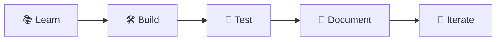

<div align="center">

# 🚀 Quick Start Guide

### Get Ready to Master Solana in 8 Weeks! 💪

</div>

---

## 🛠️ Environment Setup

### ✅ Prerequisites Checklist

| Requirement | Version | Installation Link | Status |
|-------------|---------|-------------------|--------|
| 📦 **Node.js** | 18+ | [nodejs.org](https://nodejs.org/) | ⬜ |
| 🗂️ **Git** | Latest | [git-scm.com](https://git-scm.com/) | ⬜ |
| 💻 **VS Code** | Latest | [code.visualstudio.com](https://code.visualstudio.com/) | ⬜ |
| ⚙️ **Solana CLI** | Latest | [docs.solana.com](https://docs.solana.com/cli/install-solana-cli-tools) | ⬜ |

### 🚀 One-Click Installation

```bash
# 🔄 Clone the repository
git clone https://github.com/Anadi-Gupta1/Solana-Client-Side-Development.git
cd Solana-Client-Side-Development

# 📦 Install all dependencies
npm install

# ✅ Verify your setup
npm run type-check

# 🎉 You're ready to start learning!
echo "🎊 Setup complete! Welcome to your Solana journey! 🎊"
```

---

## 📅 8-Week Learning Timeline

<div align="center">

### 🎯 Your Journey to Solana Mastery

</div>

### 🌱 **Week 1-2: Building Strong Foundations**

<details>
<summary><strong>🔗 Phase 1: Core Knowledge (Click to expand)</strong></summary>

#### 📚 **Week 1: Blockchain & Cryptography**
- **🎯 Goal**: Understand the fundamentals
- **📖 Reading**: Bitcoin & Solana whitepapers
- **🛠️ Hands-on**: Implement basic cryptographic functions
- **✅ Milestone**: Create your first hash function

```bash
# Day 1-2: Blockchain Basics
cd 01-blockchain-fundamentals
# Read whitepapers and take notes

# Day 3-5: Cryptography Deep Dive  
cd ../02-cryptography
# Implement hashing and signature examples

# Weekend Project: Compare consensus mechanisms
```

#### 💼 **Week 2: Wallet & Security**
- **🎯 Goal**: Secure wallet management
- **🛠️ Hands-on**: Create wallets, request airdrops
- **✅ Milestone**: Successfully manage testnet SOL

```bash
# Day 1-3: Wallet Creation
cd 03-wallet-setup
solana-keygen new --outfile ./my-wallet.json

# Day 4-5: Security Best Practices
# Set up hardware wallet integration

# Weekend: Acquire mainnet SOL from exchange
```

</details>

### 🏗️ **Week 3-4: Mastering Solana Architecture**

<details>
<summary><strong>🎯 Phase 2: Core Concepts (Click to expand)</strong></summary>

#### 🏗️ **Week 3: Account Model & PDAs**
- **🎯 Goal**: Master Solana's unique architecture
- **🛠️ Hands-on**: Create accounts, implement PDAs
- **✅ Milestone**: Deploy your first program account

#### ⚡ **Week 4: Transactions & Performance**
- **🎯 Goal**: Build high-performance applications
- **🛠️ Hands-on**: Optimize transaction throughput
- **✅ Milestone**: Achieve 1000+ TPS in tests

</details>

### 🎨 **Week 5-6: Building Applications**

<details>
<summary><strong>🚀 Phase 3: DApp Development (Click to expand)</strong></summary>

#### 🌐 **Week 5: RPC & Real-time Data**
- **🎯 Goal**: Master blockchain communication
- **🛠️ Hands-on**: WebSocket subscriptions, data queries
- **✅ Milestone**: Real-time price monitoring app

#### 🎨 **Week 6: Wallet Integration & UX**
- **🎯 Goal**: Create seamless user experiences
- **🛠️ Hands-on**: React wallet adapters, trading UI
- **✅ Milestone**: Full-featured trading interface

</details>

### 🏆 **Week 7-8: Portfolio Projects**

<details>
<summary><strong>🌟 Phase 4: Advanced Projects (Click to expand)</strong></summary>

#### 📦 **Week 7: Data & Contracts**
- **🎯 Goal**: Advanced data handling
- **🛠️ Hands-on**: Borsh serialization, IDL parsing
- **✅ Milestone**: Custom contract interaction

#### 🏪 **Week 8: Memecoin Marketplace**
- **🎯 Goal**: Build portfolio centerpiece
- **🛠️ Hands-on**: Full-stack marketplace development
- **✅ Milestone**: Production-ready DApp

</details>

---

## 📊 Daily Study Routine

### ⏰ **Optimal Learning Schedule (2-3 hours/day)**

| Time Slot | Activity | Duration | Focus |
|-----------|----------|----------|-------|
| 🌅 **Morning** | 📖 **Reading & Theory** | 30 min | Whitepapers, documentation |
| 🏗️ **Afternoon** | 💻 **Hands-on Coding** | 90 min | Examples, exercises, projects |
| 🌆 **Evening** | 🔬 **Experimentation** | 30 min | Try new ideas, explore |
| 🌙 **Before Bed** | 📝 **Documentation** | 15 min | Notes, progress tracking |

### 🎯 **Weekly Goals Framework**



---

## 🏅 Milestone Tracking

### 🎖️ **Achievement System**

Track your progress with these exciting milestones:

| Level | Badge | Requirement | Reward |
|-------|-------|-------------|---------|
| 1️⃣ | 🥉 **Crypto Rookie** | Complete Week 1-2 | Understanding certificate |
| 2️⃣ | 🥈 **Solana Scholar** | Complete Week 3-4 | Architecture mastery |
| 3️⃣ | 🥇 **DApp Developer** | Complete Week 5-6 | Application expertise |
| 4️⃣ | 🏆 **Blockchain Builder** | Complete Week 7-8 | Portfolio champion |
| 5️⃣ | 🌟 **Solana Master** | Deploy to production | Community recognition |

### 📈 **Progress Dashboard**

<div align="center">

```ascii
Week 1  ████████████████████  100%  ✅ Completed
Week 2  ████████████████████  100%  ✅ Completed  
Week 3  ██████████░░░░░░░░░░   50%  🔄 In Progress
Week 4  ░░░░░░░░░░░░░░░░░░░░    0%  ⏳ Pending
Week 5  ░░░░░░░░░░░░░░░░░░░░    0%  ⏳ Pending
Week 6  ░░░░░░░░░░░░░░░░░░░░    0%  ⏳ Pending
Week 7  ░░░░░░░░░░░░░░░░░░░░    0%  ⏳ Pending
Week 8  ░░░░░░░░░░░░░░░░░░░░    0%  ⏳ Pending
```

</div>

---

## 🆘 Support & Resources

### 🤝 **Community Support**

| Platform | Purpose | Link |
|----------|---------|------|
| 💬 **Discord** | Real-time help | [Solana Discord](https://discord.gg/solana) |
| 🐦 **Twitter** | Updates & news | [@solana](https://twitter.com/solana) |
| 📺 **YouTube** | Video tutorials | [Solana Channel](https://youtube.com/@SolanaFndn) |
| 📚 **Stack Exchange** | Q&A | [solana.stackexchange.com](https://solana.stackexchange.com/) |

### 🚨 **Need Help?**

<div align="center">

**Stuck on something? Don't worry, we've all been there! 💪**

<a href="https://github.com/Anadi-Gupta1/Solana-Client-Side-Development/issues">
  
</a>
<a href="https://discord.gg/solana">
  
</a>

</div>

### 📱 **Essential Tools**

- 🦊 **[Phantom Wallet](https://phantom.app/)** - Most popular Solana wallet
- 🔥 **[Solflare](https://solflare.com/)** - Feature-rich wallet
- 📊 **[Solscan](https://solscan.io/)** - Blockchain explorer
- 🔍 **[Step Finance](https://step.finance/)** - Portfolio tracker

---

## 🎉 Ready to Start?

<div align="center">

### 🚀 **Your Solana Adventure Begins Now!**

<a href="./01-blockchain-fundamentals/README.md">
  
</a>

**Remember: Every expert was once a beginner! 🌱➡️🌳**

</div>

---
*Consistency is key - study a little every day rather than cramming*
