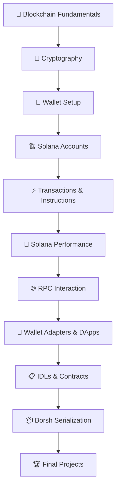

<div align="center">

# 🚀 Solana Client-Side Development - Phase 1


### 🌟 Complete Learning Path for Solana Blockchain Development

[](https://github.com/Anadi-Gupta1/Solana-Client-Side-Development)
[](https://opensource.org/licenses/MIT)
[](https://www.typescriptlang.org/)
[](https://solana.com/)

</div>

---

## 📋 Table of Contents

- [🎯 Overview](#-overview)
- [🗺️ Learning Path](#️-learning-path)
- [🚀 Quick Start](#-quick-start)
- [📚 Module Structure](#-module-structure)
- [🛠️ Prerequisites](#️-prerequisites)
- [📖 Resources](#-resources)
- [✅ Progress Tracking](#-progress-tracking)
- [🏆 Projects](#-projects)
- [🤝 Contributing](#-contributing)
- [📄 License](#-license)

## 🎯 Overview

Welcome to the **most comprehensive Solana client-side development learning path**! 🎉 

This repository is your complete guide to mastering Solana blockchain development, from understanding Bitcoin's whitepaper to building production-ready DApps. Whether you're a blockchain beginner or an experienced developer, this structured approach will take you from zero to hero! 💪

### 🌟 What You'll Learn
- 🔗 Blockchain fundamentals and Solana's innovations
- 🔐 Cryptography, digital signatures, and security
- 💼 Wallet creation and SOL management
- 🏗️ Solana's unique account model and PDAs
- ⚡ High-performance transaction optimization
- 🌐 RPC interactions and real-time data
- 🎨 Building beautiful DApps with wallet integration
- 🚀 Portfolio-worthy projects including a memecoin marketplace

## 🗺️ Learning Path

<div align="center">



</div>

## 🚀 Quick Start

### ⚡ 8-Week Learning Timeline

<details>
<summary><strong>📅 Click to see the complete timeline</strong></summary>

| Week | 📚 Focus | 🎯 Goals | 🏆 Deliverables |
|------|---------|----------|-----------------|
| **Week 1-2** | 🔗 Foundations | Master blockchain & crypto basics | ✅ Wallet created, SOL acquired |
| **Week 3-4** | 🏗️ Core Concepts | Understand Solana's architecture | ✅ Account management scripts |
| **Week 5-6** | 🎨 Application Development | Build your first DApps | ✅ Wallet-connected app |
| **Week 7-8** | 🚀 Advanced Projects | Portfolio-worthy applications | ✅ Memecoin marketplace |

</details>

### 🛠️ Installation & Setup

```bash
# 1. Clone the repository
git clone https://github.com/Anadi-Gupta1/Solana-Client-Side-Development.git
cd Solana-Client-Side-Development

# 2. Install dependencies
npm install

# 3. Verify setup
npm run type-check

# 4. Start your learning journey!
code . # Open in VS Code
```

## 📚 Module Structure

### 🎓 Phase 1: Foundations (Weeks 1-2)

<table>
<tr>
<td width="60">🔗</td>
<td width="200"><strong>Blockchain Fundamentals</strong></td>
<td>Bitcoin & Solana whitepapers, consensus mechanisms</td>
</tr>
<tr>
<td>🔐</td>
<td><strong>Cryptography</strong></td>
<td>Hashing, ECDSA, ED25519, digital signatures</td>
</tr>
<tr>
<td>💼</td>
<td><strong>Wallet Setup</strong></td>
<td>CLI wallets, browser extensions, security practices</td>
</tr>
</table>

### 🏗️ Phase 2: Core Concepts (Weeks 3-4)

<table>
<tr>
<td width="60">🏗️</td>
<td width="200"><strong>Solana Accounts</strong></td>
<td>Data accounts, PDAs, program accounts, ownership</td>
</tr>
<tr>
<td>⚡</td>
<td><strong>Transactions & Instructions</strong></td>
<td>Transaction formats, optimization, parallel processing</td>
</tr>
<tr>
<td>🚀</td>
<td><strong>Solana Performance</strong></td>
<td>PoH, Sealevel, transaction inputs, benchmarking</td>
</tr>
</table>

### 🎨 Phase 3: Application Development (Weeks 5-6)

<table>
<tr>
<td width="60">🌐</td>
<td width="200"><strong>RPC Interaction</strong></td>
<td>API calls, WebSocket subscriptions, data queries</td>
</tr>
<tr>
<td>🎨</td>
<td><strong>Wallet Adapters & DApps</strong></td>
<td>React integration, trading interfaces, UX patterns</td>
</tr>
<tr>
<td>📋</td>
<td><strong>IDLs & Contracts</strong></td>
<td>Interface definitions, official vs custom clients</td>
</tr>
</table>

### 🚀 Phase 4: Advanced Projects (Weeks 7-8)

<table>
<tr>
<td width="60">📦</td>
<td width="200"><strong>Borsh Serialization</strong></td>
<td>Data encoding, Borsh.js, performance optimization</td>
</tr>
<tr>
<td>🏆</td>
<td><strong>Final Projects</strong></td>
<td>Memecoin marketplace, portfolio tracker, token launcher</td>
</tr>
</table>

## 🛠️ Prerequisites

<div align="center">

| Requirement | Level | Description |
|-------------|-------|-------------|
| 💻 **Programming** | Beginner+ | JavaScript/TypeScript basics |
| 🔧 **Tools** | Essential | Node.js 18+, Git, VS Code |
| 🧠 **Mindset** | Required | Curiosity and persistence! |

</div>

### 📦 Tech Stack You'll Master

<div align="center">


</div>

## 📖 Resources

### 🌟 Essential Links

| Resource | Description | Link |
|----------|-------------|------|
| 📚 **Solana Docs** | Official documentation | [docs.solana.com](https://docs.solana.com/) |
| 👨‍🍳 **Solana Cookbook** | Practical code examples | [solanacookbook.com](https://solanacookbook.com/) |
| ⚓ **Anchor Framework** | Smart contract framework | [anchor-lang.com](https://www.anchor-lang.com/) |
| 🎯 **Jupiter** | DEX aggregator | [jup.ag](https://jup.ag/) |
| 👁️ **Birdeye** | Analytics platform | [birdeye.so](https://birdeye.so/) |

### 🎥 Video Tutorials
- [Solana Development Course](https://www.youtube.com/playlist?list=PLilwLeBwGuK6NsYMPP_BlVkeQgff0NwvU)
- [Anchor Tutorial Series](https://www.youtube.com/playlist?list=PLilwLeBwGuK7Z2dXft_pmLZ675fuPgkA0)

### 📱 Discord Communities
- [Solana Discord](https://discord.gg/solana) - Official community
- [Anchor Discord](https://discord.gg/8HwmBtt2ss) - Framework support

## ✅ Progress Tracking

### 📊 Learning Dashboard

<details>
<summary><strong>🎯 Click to track your progress</strong></summary>

#### 🔗 Phase 1: Foundations
- [ ] 📖 Read Bitcoin whitepaper
- [ ] 📖 Study Solana whitepaper  
- [ ] 🔐 Implement basic cryptography
- [ ] 💼 Create testnet wallet
- [ ] 💰 Successfully request airdrop
- [ ] 🛡️ Set up security practices

#### 🏗️ Phase 2: Core Concepts
- [ ] 🏗️ Create and manage accounts
- [ ] 🎯 Implement PDA examples
- [ ] ⚡ Build optimized transactions
- [ ] 📊 Benchmark performance
- [ ] 🔄 Handle parallel processing

#### 🎨 Phase 3: Application Development
- [ ] 🌐 Master RPC interactions
- [ ] 🔌 Integrate wallet adapters
- [ ] 🎨 Build responsive UI
- [ ] 📋 Parse contract data
- [ ] 🔍 Implement real-time monitoring

#### 🚀 Phase 4: Advanced Projects
- [ ] 📦 Master Borsh serialization
- [ ] 🏪 Build memecoin marketplace
- [ ] 📊 Create portfolio tracker
- [ ] 🚀 Develop token launcher
- [ ] 🎯 Deploy to production

</details>

### 🏅 Achievement Badges

Earn these badges as you progress:

| Badge | Requirement | Reward |
|-------|-------------|---------|
| 🥉 **Blockchain Basics** | Complete modules 1-3 | Understanding foundation |
| 🥈 **Solana Developer** | Complete modules 4-7 | Core competency |
| 🥇 **DApp Master** | Complete modules 8-10 | Advanced skills |
| 🏆 **Project Champion** | Complete final projects | Portfolio ready! |

## 🏆 Projects

### 🎯 Featured Project: Memecoin Marketplace

<div align="center">

</div>

Build a **DexScreener/Vector clone** with:
- 🔍 Real-time token discovery
- 📈 Advanced charting (TradingView integration)
- 💹 Jupiter DEX integration for trading
- 📊 Portfolio tracking and P&L analysis
- 🐋 Whale activity monitoring
- 📱 Mobile-responsive design

### 🌟 Additional Projects

| Project | Description | Tech Stack |
|---------|-------------|------------|
| 📊 **Portfolio Tracker** | Multi-wallet portfolio analytics | React + Chart.js |
| 🚀 **Token Launcher** | Create and manage custom tokens | SPL Token + Metaplex |
| 🎮 **NFT Marketplace** | Trade Solana NFTs | Metaplex + Jupiter |

## 🤝 Contributing

We welcome contributions! 🎉

### 🔧 How to Contribute

1. 🍴 Fork the repository
2. 🌱 Create a feature branch (`git checkout -b feature/amazing-feature`)
3. 💝 Commit your changes (`git commit -m 'Add amazing feature'`)
4. 📤 Push to the branch (`git push origin feature/amazing-feature`)
5. 🎯 Open a Pull Request

### 💡 Ideas for Contributions

- 📝 Add more examples and tutorials
- 🐛 Fix bugs and improve documentation
- 🌟 Create additional learning modules
- 🎨 Improve UI/UX of example projects
- 📊 Add more project templates

## 📄 License

This project is licensed under the **MIT License** - see the [LICENSE](LICENSE) file for details.

---

<div align="center">

### 🌟 Ready to Start Your Solana Journey?

<a href="./QUICK_START.md">
  
</a>

### Made with ❤️ by the Solana Community

<p>
  <a href="https://github.com/Anadi-Gupta1">
    
  </a>
  <a href="https://twitter.com">
    
  </a>
</p>

**⭐ If this repository helped you, please give it a star! ⭐**

</div>
- [ ] Module 10: Borsh Serialization
- [ ] Module 11: Final Projects

---

*Last Updated: September 2025*
